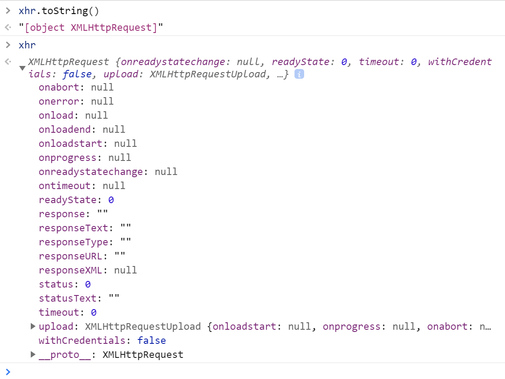
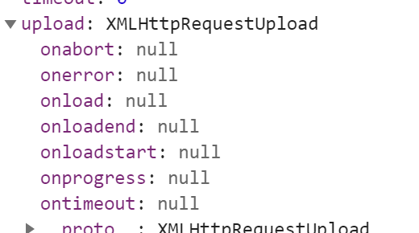

# ajax

现代浏览器中, 虽然几乎全部支持ajax, 但它们的技术方案却分为两种:

* 标准浏览器通过 XMLHttpRequest 对象实现了ajax的功能. 只需要通过一行语句便可创建一个用于发送ajax请求的对象.
```js
var xhr = new XMLHttpRequest();
```
* IE浏览器通过 XMLHttpRequest 或者 ActiveXObject 对象同样实现了ajax的功能.

IE5及之后的浏览器均可以通过如下语句获取xhr对象:
```js
var xhr = new ActiveXObject("Msxml2.XMLHTTP");// 即MSXML3
var xhr = new ActiveXObject("Microsoft.XMLHTTP");// 很老的api,虽然浏览器支持,功能可能不完善,故不建议使用
```

```js
function getXHR(){
  var xhr = null;
  if(window.XMLHttpRequest) {
    xhr = new XMLHttpRequest();
  } else if (window.ActiveXObject) {
    try {
      xhr = new ActiveXObject("Msxml2.XMLHTTP");
    } catch (e) {
      try {
        xhr = new ActiveXObject("Microsoft.XMLHTTP");
      } catch (e) { 
        alert("您的浏览器暂不支持Ajax!");
      }
    }
  }
  return xhr;
}
```


> 一个xhr实例对象拥有10个普通属性+9个方法.

## readyState
>只读属性, readyState属性记录了ajax调用过程中所有可能的状态. 它的取值简单明了, 如下:

|  readyState   | 对应常量  | 描述 |
|  ----  | ----  |----|
|0 (未初始化)| xhr.UNSENT  | 请求已建立, 但未初始化(此时未调用open方法) |
|1 (初始化)| xhr.OPENED  | 请求已建立, 但未发送 (已调用open方法, 但未调用send方法) |
|2 (发送数据)| xhr.HEADERS_RECEIVED  | 请求已发送 (send方法已调用, 已收到响应头) |
|3 (数据传送中)| xhr.LOADING  | 请求处理中, 因响应内容不全, 这时通过responseBody和responseText获取可能会出现错误 |
|4 (完成)| xhr.DONE  | 数据接收完毕, 此时可以通过通过responseBody和responseText获取完整的响应数据 |

>注意, readyState 是一个只读属性, 想要改变它的值是不可行的.

## onreadystatechange

>onreadystatechange事件回调方法在readystate状态改变时触发, 在一个收到响应的ajax请求周期中, onreadystatechange 方法会被触发4次. 因此可以在 onreadystatechange 方法中绑定一些事件回调

## status 
>status表示http请求的状态

## statusText
>statusText表示服务器的响应状态信息

## onloadstart
>onloadstart事件回调方法在ajax请求发送之前触发, 触发时机在 readyState==1 状态之后, readyState==2 状态之前.

## onprogress
> onprogress事件回调方法在 readyState==3 状态时开始触发, 默认传入 ProgressEvent 对象, 可通过 e.loaded/e.total 来计算加载资源的进度, 该方法用于获取资源的下载进度.

## onload 
>onload事件回调方法在ajax请求成功后触发, 触发时机在 readyState==4 状态之后.

## onloadend 
>onloadend事件回调方法在ajax请求完成后触发, 触发时机在 readyState==4 状态之后(收到响应时) 或者 readyState==2 状态之后(未收到响应时).
onloadend方法中默认将传入一个ProgressEvent事件进度对象.

## timeout
>timeout属性用于指定ajax的超时时长.

## ontimeout
>ontimeout方法在ajax请求超时时触发, 通过它可以在ajax请求超时时做一些后续处理.

## response
> 只读属性, response表示服务器的响应内容 

## responseText
> 只读属性, responseText表示服务器响应内容的文本形式.

## responseXML
>只读属性, responseXML表示xml形式的响应数据, 缺省为null, 若数据不是有效的xml, 则会报错.

## responseType
>responseType表示响应的类型, 缺省为空字符串, 可取 "arraybuffer" , "blob" , "document" , "json" , and "text" 共五种类型.

## responseURL
>responseURL返回ajax请求最终的URL, 如果请求中存在重定向, 那么responseURL表示重定向之后的URL.

## withCredentials
>withCredentials是一个布尔值, 默认为false, 表示跨域请求中不发送cookies等信息. 当它设置为true时, cookies , authorization headers 或者TLS客户端证书 都可以正常发送和接收. 显然它的值对同域请求没有影响.


## abort
>abort方法用于取消ajax请求, 取消后, readyState 状态将被设置为 0 (UNSENT). 如下, 调用abort 方法后, 请求将被取消.

## getResponseHeader
>getResponseHeader方法用于获取ajax响应头中指定name的值. 如果response headers中存在相同的name, 那么它们的值将自动以字符串的形式连接在一起.

```js
console.log(xhr.getResponseHeader('Content-Type'));//"text/html"
```

## getAllResponseHeaders
>getAllResponseHeaders方法用于获取所有安全的ajax响应头, 响应头以字符串形式返回. 每个HTTP报头名称和值用冒号分隔, 如key:value, 并以\r\n结束.

```js
xhr.onreadystatechange = function() {
  if(this.readyState == this.HEADERS_RECEIVED) {
    console.log(this.getAllResponseHeaders());
  }
}
//Content-Type: text/html"
```

## setRequestHeader
>设置请求头

```js
//指定请求的type为json格式
xhr.setRequestHeader("Content-type", "application/json");
//除此之外, 还可以设置其他的请求头
xhr.setRequestHeader('x-requested-with', '123456');
```

## onerror
>onerror方法用于在ajax请求出错后执行. 通常只在网络出现问题时或者ERR_CONNECTION_RESET时触发(如果请求返回的是407状态码, chrome下也会触发onerror).

## upload
属性默认返回一个 XMLHttpRequestUpload 对象,用于上传资源. 该对象具有如下方法:
* onloadstart
* onprogress
* onabort
* onerror
* onload
* ontimeout
* onloadend
上述方法功能同 xhr 对象中同名方法一致. 其中, onprogress 事件回调方法可用于跟踪资源上传的进度.
```js
xhr.upload.onprogress = function(e){
  var percent = 100 * e.loaded / e.total |0;
  console.log('upload: ' + precent + '%');
}
```

## overrideMimeType
>overrideMimeType方法用于强制修改response的 Content-Type

```js
xhr.getResponseHeader('Content-Type');//"text/plain"
xhr.responseXML;//null
```

>通过overrideMimeType方法将response的MIME类型设置为 text/xml;charset=utf-8 , 如下所示:

```js
xhr.overrideMimeType("text/xml; charset = utf-8");
xhr.send();
```
```js
xhr.getResponseHeader('Content-Type');//"text/xml; charset = utf-8"
```

## XHR一级
>XHR1 即 XMLHttpRequest Level 1. XHR1时, xhr对象具有如下缺点:

* 仅支持文本数据传输, 无法传输二进制数据.
* 传输数据时, 没有进度信息提示, 只能提示是否完成.
* 受浏览器 同源策略 限制, 只能请求同域资源.
* 没有超时机制, 不方便掌控ajax请求节奏.

## XHR二级
>XHR2 即 XMLHttpRequest Level 2. XHR2针对XHR1的上述缺点做了如下改进:

* 支持二进制数据, 可以上传文件, 可以使用FormData对象管理表单.
* 提供进度提示, 可通过 xhr.upload.onprogress 事件回调方法获取传输进度.
* 依然受 同源策略 限制, 这个安全机制不会变. XHR2新提供 Access-Control-Allow-Origin 等headers, 设置为 * 时表示允许任何域名请求, 从而实现跨域CORS访问(有关CORS详细介绍请耐心往下读).
*  可以设置timeout 及 ontimeout, 方便设置超时时长和超时后续处理.

```js 
//可直接创建FormData实例
var data = new FormData();
data.append("name", "louis");
xhr.send(data);
//还可以通过传入表单DOM对象来创建FormData实例
var form = document.getElementById('form');
var data = new FormData(form);
data.append("password", "123456");
xhr.send(data);

```
$.ajax()


