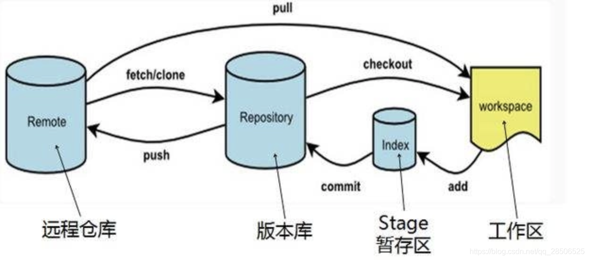

# Git 基本使用
> 学习地址: https://blog.csdn.net/qq_28506525/article/details/103773425

## 基本命令
### 配置用户名和密码
```
$ git config --global user.name "Your Name"
$ git config --global user.email "user@xxx.com"
```
### 初始化git本地仓库
版本库又叫仓库(repository)，这个目录里面的所有文件都可以被Git管理起来，每个文件的修改、删除都能被跟踪。
在合适的位置直接鼠标右键创建一个空目录作为仓库，然后从Git-Bash命令行进入到该目录，或者也可以使用命令行创建空目录，再进入到该空目录中。  
以下给出创建并初始化git仓库的代码：  
进入到仓库的位置，我将仓库放在了C:\Android\git-repositories目录下，注意，使用cd命令进入到目录中时，在Git-Bash中应该使用斜线”/”，而不是反斜线”\”。
```
$ cd E:/learn
$ mkdir -front-end-learn           创建新的目录
$ cd -front-end-learn           进入到创建的目录
```
### git init 初始化仓库
```
$ git init
Initialized empty Git repository in E:/learn/-front-end-learn/.git/
(显示信息意思为：初始化了一个空的Git仓库，-front-end-learn目录下多了一个.git目录，用来管理版本库的)
```
### 将数据提交Git仓库
#### 第一步检查我们的需要提交的文件状态
```
git status
```
#### 第二步添加文件
```
$ git add 添加所有的文件、文件夹
$ git add <file> 添加指定名称的文件,<>内部写文件全称
注：如果文件没有做出任何修改，则默认不会添加任何文件
```
#### 第三步提交文件
``` 
git commit -m "info"
提交本次事务，即将add的文件提交到git仓库，引号内部表示本次提交的提示信息
```
>然后可以使用 git status 查询我们提交的状态，这个时候如果 提交成功之后，文件名会变成绿色
#### 第四步提交文件到远程仓库
```
$ git push  把文件提交到我们远程的github仓库或者码云仓库里
```
### 查询该文件和git仓库中的文件的区别，即做了什么修改
```
$ git diff <文件全称>
如果已经add了，就打印不出有什么修改了，这一步骤应该在add之前，即添加之前可以用来看看做了什么修改。
```
### 打印历史记录
```
$ git log
Commit xxx               commit id 版本号
Author:xxx<xxx@xxx.com>  提交人和邮箱
Date：xxx                提交的时间
    XXXX                 提交的信息(所以说，提交信息很重要！！！)
$ cat <文件全名称>         显示整个文件的内容
```

### 版本回退
```
$ git reset --hard head^
在Git中，HEAD表示当前版本，就是最新提交的版本，即使用git log打印出来的位于第一位的版本，上一个版本就是HEAD^，上上个版本就是HEAD^^，  
当前向上100个可以写成HEAD~100。当然，还有一种方式就是直接使用commit id来代替HEAD^，比如版本号是asfdjashfkj3456787654323e4343，  
那么就可以直接使用命令：  
$ git reset --hard asfdjashfkj34567            使用前几位表示即可，git会自动查找  
注：版本回退以后，使用git log打印的历史记录都是回退版本之前的数据，之后的都没有了，不过放心，git总有后悔药可以吃哒~  
1.如果命令行窗口没有关闭，直接去前面找commit id即可；  
2.如果命令行窗口关闭了，或者第二天后悔了，可以进入到该目录下，使用git reflog命令来查看以前的每一次命令，可以获得每次提交的commit id，  
就可以版本回退了。  
$ git reflog     可以查看命令历史，包含提交的commit id
```
### 工作区和暂存区
* 工作区
就是电脑里能看到的目录，比如上面创建E:\learn\-front-end-learn文件夹就是一个工作区。
* 版本库
工作区中有一个隐藏目录.git，就是Git的版本库，版本库里存放了很多的东西，其中最重要的就是state(或者叫index)的暂存区，还有Git为我们自动创建的第一个分支master，以及指向master的一个指针叫HEAD。

```
前面讲到，将文件存入到Git版本库里，分两步执行：
第一步：用git add命令将工作区的修改文件添加到暂存区：（多次操作）
第二步：用git commit命令将暂存区的所有修改内容提交到当前分支。（事务提交，包含第一步多次操作，注意，不在暂存区的修改不会被commit）
一旦事务提交之后，如果对工作区没有做什么修改，那么工作区就是干净的。
因为创建Git版本库的时候，Git自动创建了一个master分支，所以现在git commit 就是往master分支上提交事务。
```

#### 在主文件夹中右键鼠标使用Git Bash Here
### 关闭证书验证
```
$ git config --global http.sslVerify false
```
### 使用克隆命令将文件克隆在本地，这里需要使用https
```
$ git clone https://gitee.com/*********/round.git
(输入用户名和密码之后，将开始下载远程仓库，这里仅仅下的是主分支-master) 
```
### 查看仓库的分支情况
```
$ git branch –a
显示如下：
* master
  round/origin/HEAD -> origin/master      HEAD-远程仓库的当前分支是主分支
  round/origin/dev                        dev分支(所有操作都会合并到该分支)
  round/origin/master                 master分支就是主分支
```
### 创建本地仓库的dev分支并且切换过去
```
$ git checkout -b dev
```
### 将远程仓库的dev分支代码复制到本地dev分支
```
$ git pull origin dev
```
### 查看本地Git仓库状态
```
$ git status
On branch dev       -只有一个本地dev分支(但是内容已经是远程仓库dev的内容了)
nothing to commit, working directory clean      -此时没有任何修改，工作区很干净
```
### 查看分支状态
```
$ git branch –a
上面显示的是本地分支，绿色字体和”*”表示的是当前所在的分支，
下面红色部分显示的是远程仓库的分支。
```
### 创建自己的分支并且切换到自己的分支，在自己的分支写代码
```
$ git checkout -b selftext
```
### 将所有修改文件提交到本地暂存区(staged)，等待提交
```
$ git add .        注意：确保此时在自己的分支上进行操作，eg：dai(我自己的名字)
$ git commit –m “xxx可写提交的信息”     将本地暂存区的代码提交到自己的分支上
```
### 切换到本地dev分支，并将远程仓库的dev分支的最新代码拉下来
```
$ git checkout dev
$ git pull origin dev
(确定自己的本地仓库的dev分支已经是最新的了)
```
### 切换到自己的分支，将dev分支合并到自己的分支上
```
$ git checkout selftext
$ git merge dev        将本地dev分支合并到自己的分支上
如果有冲突，则需要再次进行add,commit操作。
```
### 解决冲突完毕后，切换到本地dev分支，将合并完毕的自己的分支合并到本地dev
```
$ git checkout dev
$ git merge selftext
```
### 推送到远程服务器
```
$ git push origin dev
```

## Gir的进阶操作
### 删除git仓库
1. 在本地仓库的目录下调用命令行删除根目录下的.git文件夹，输入
```
find . -name ".git" | xargs rm -Rf
```
2. 手动删除掉残留的.git文件
3. 在命令行中输入rm -rf + github仓库地址，例
```
rm -rf https://github.com/wuanji2019/-front-end-learn.git
```
4. 在github的对应的库中到setting删除库。
### 其他命令
```
$ git remote –v   显示远程分支的名称和url
```
### 忽略文件
```
有一些文件并不能上传到git上。比如我们npm install 安装之后有的node modules
所以需要在项目的根目录下创建一个名称为.gitignore文件，然后把要忽略的文件名填进去，Git就会自动忽略这些文件。  
不需要从头写.gitignore文件，GitHub已经为我们准备了各种配置文件，只需要组合一下就可以使用了。
```
## Git Gui简单使用
注意：个人建议使用命令行方式进行版本管理，但是可以使用图形化界面看本次代码的改动，比较方便。   
1. 在所在项目，右键选择git gui 
2. 界面如下，如果会使用命令行，那么一看就明白了
3. 配置 UTF-8:Edit-Options:
    如果之前设置好了，直接在项目中右键进入，那么这些都不用设置：
4. Add commit push很快完成，不用输i入命令
5. 查看代码对比  如果想要查看所有的改动历史，可以：就可以看到所有的代码改动历史，而不用去网上看。注意，这里能看到所有人的改动哦！！！非常强大！
6. 设置和远程仓库关联（如果从项目根目录进入，则自动关联，不用设置）如果需要设置，选择remote-Add，参考如下：
7. 新建项目，从远程仓库克隆  右键选择git gui:选择克隆已有版本库。

