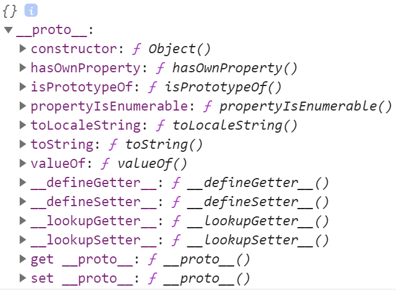

# ES6 学习 
学习地址：https://juejin.im/post/5d9bf530518825427b27639d#heading-14

## 声明
声明方法 var、const、let、function、class、import

* 不允许重复声明
* 未定义就使用会报错：const命令和let命令不存在变量提升
* 暂时性死区：在代码块内使用const命令和let命令声明变量之前，该变量都不可用

## 解构赋值

* 匹配模式：只要等号两边的模式相同，左边的变量就会被赋予对应的值
* 解构赋值规则：只要等号右边的值不是对象或数组，就先将其转为对象
* 解构默认值生效条件：属性值严格等于undefined
* 解构遵循匹配模式
* 解构不成功时变量的值等于undefined
* undefined和null无法转为对象，因此无法进行解构

## 字符串扩展

* Unicode表示法  
ps: 小程序跳转webview的时候 经常使用encodeURIComponent来对url的参数进行转码
escape() 使用转义序列替换某些字符来对字符串进行编码
unescape()  对使用 escape() 编码的字符串进行解码
encodeURI() 通过转义某些字符对 URI 进行编码
decodeURI() 对使用 encodeURI() 方法编码的字符串进行解码
encodeURIComponent()  通过某些转义字符对 URI 的组件进行编码
deencodeURIComponent()  对使用 encodeURIComponent() 方法编码的字符串进行解码
* 字符串遍历 可通过for-of遍历字符串
* 字符串模板
* 标签模板 函数参数的特殊调用
* String.raw()：返回把字符串所有变量替换且对斜杠进行转义的结果
```js
function showraw(strings,...values){
    console.log(strings.raw)
}

showraw`Hello\nWorld`
// ["Hello\nWorld"]
console.log(`Hello\nWorld`)
// Hello
// World

```
* String.fromCodePoint()：返回码点对应字符
* codePointAt()：返回字符对应码点(String.fromCodePoint()的逆操作)
* normalize()：把字符的不同表示方法统一为同样形式，返回新字符串(Unicode正规化)
* repeat()：把字符串重复n次，返回新字符串 'hello'.repeat(2) // "hellohello"
* matchAll()：返回正则表达式在字符串的所有匹配
* includes()：是否存在指定字符串
* startsWith()：是否存在字符串头部指定字符串
* endsWith()：是否存在字符串尾部指定字符串

## 数值扩展

* 二进制表示法：0b或0B开头表示二进制(0bXX或0BXX)
* 八进制表示法：0o或0O开头表示二进制(0oXX或0OXX)
* Number.EPSILON：数值最小精度
* Number.MIN_SAFE_INTEGER：最小安全数值(-2^53)
* Number.MAX_SAFE_INTEGER：最大安全数值(2^53)
* Number.parseInt()：返回转换值的整数部分
* Number.parseFloat()：返回转换值的浮点数部分
* Number.isFinite()：是否为有限数值
* Number.isNaN() 是否为NaN
* Number.isInteger()：是否为整数
* Number.isSafeInteger()：是否在数值安全范围内
* Math.trunc()：返回数值整数部分
* Math.sign()：返回数值类型(正数1、负数-1、零0)
* Math.cbrt()：返回数值立方根
* Math.clz32()：返回数值的32位无符号整数形式
* Math.imul()：返回两个数值相乘
* Math.fround()：返回数值的32位单精度浮点数形式
* Math.hypot()：返回所有数值平方和的平方根
* Math.expm1()：返回e^n - 1
* Math.log1p()：返回1 + n的自然对数(Math.log(1 + n))
* Math.log10()：返回以10为底的n的对数
* Math.log2()：返回以2为底的n的对数
* Math.sinh()：返回n的双曲正弦
* Math.cosh()：返回n的双曲余弦
* Math.tanh()：返回n的双曲正切
* Math.asinh()：返回n的反双曲正弦
* Math.acosh()：返回n的反双曲余弦
* Math.atanh()：返回n的反双曲正切

## 对象扩展

* 方法的name属性：返回方法函数名
* super关键字：指向当前对象的原型对象(只能用在对象的简写方法中method() {})
* Object.is()：对比两值是否相等  Object.is(a,b)
* Object.assign()：合并对象(浅拷贝)，返回原对象  Object.assign({},{})
* Object.getPrototypeOf()：返回对象的原型对象
* Object.setPrototypeOf()：设置对象的原型对象
* __proto__：返回或设置对象的原型对象
>属性遍历

* for-in：遍历对象自身可继承可枚举属性
* Object.keys()：返回对象自身可枚举属性键组成的数组
* Object.getOwnPropertyNames()：返回对象自身非Symbol属性键组成的数组
* Object.getOwnPropertySymbols()：返回对象自身Symbol属性键组成的数组
* Reflect.ownKeys()：返回对象自身全部属性键组成的数组

## 数组扩展
* 扩展运算符(...)
* Array.from() 转换具有Iterator接口的数据结构为真正数组，返回新数组
```js
let arr = Array.from('juejin'); 
console.log(arr); //["j", "u", "e", "j", "i", "n"]
```
* Array.of()：转换一组值为真正数组，返回新数组
* copyWithin()：把指定位置的成员复制到其他位置，返回原数组
* find()：返回第一个符合条件的成员
* findIndex()：返回第一个符合条件的成员索引值
* fill 根据指定值填充整个数组，返回原数组
* keys()：返回以索引值为遍历器的对象
* values()：返回以属性值为遍历器的对象
* entries()：返回以索引值和属性值为遍历器的对象
* 数组空位：ES6明确将数组空位转为undefined(空位处理规不一，建议避免出现)
>扩展应用

1. 克隆数组 const arr = [...arr1]
2. 合并数组 const arr = [...arr1, ...arr2]
3. 拼接数组：arr.push(...arr1)
4. 代替apply：Math.max.apply(null, [x, y]) => Math.max(...[x, y])
5. 转换字符串为数组：[..."hello"]
6. 转换类数组对象为数组：[...Arguments, ...NodeList]
7. 转换可遍历对象为数组：[...String, ...Set, ...Map, ...Generator]
8. 与数组解构赋值结合：const [x, ...rest/spread] = [1, 2, 3]
9. 计算Unicode字符长度：Array.from("hello").length => [..."hello"].length
>使用keys()、values()、entries()返回的遍历器对象，可用for-of自动遍历或next()手动遍历

## 函数扩展
* 参数默认值
1. 指定某个参数不得省略，省略即抛出错误：function Func(x = throwMissing()) {}
2. 将参数默认值设为undefined，表明此参数可省略：Func(undefined, 1)

* rest/spread参数(...)：返回函数多余参数
* 严格模式：在严格条件下运行JS
* name属性：返回函数的函数名
1. 将匿名函数赋值给变量：空字符串(ES5)、变量名(ES6)
2. 将具名函数赋值给变量：函数名(ES5和ES6)
3. bind返回的函数：bound 函数名(ES5和ES6)
4. Function构造函数返回的函数实例：anonymous(ES5和ES6)    
* 箭头函数 ()=>{}
1. this指向固定化
    并非因为内部有绑定this的机制，而是根本没有自己的this，导致内部的this就是外层代码块的this
    因为没有this，因此不能用作构造函数
* 尾调用优化：只保留内层函数的调用帧
1. 尾调用
   定义：某个函数的最后一步是调用另一个函数
   形式：function f(x) { return g(x); }
2. 尾递归
   定义：函数尾调用自身
   作用：只要使用尾递归就不会发生栈溢出，相对节省内存
   实现：把所有用到的内部变量改写成函数的参数并使用参数默认值
>箭头函数误区

* 函数体内的this是定义时所在的对象而不是使用时所在的对象
* 可让this指向固定化，这种特性很有利于封装回调函数
* 不可当作构造函数，因此箭头函数不可使用new命令
* 不可使用yield命令，因此箭头函数不能用作Generator函数
* 不可使用Arguments对象，此对象在函数体内不存在(可用rest/spread参数代替)
* 返回对象时必须在对象外面加上括号

## 正则扩展
* 变更RegExp构造函数入参：允许首参数为正则对象，尾参数为正则修饰符(返回的正则表达式会忽略原正则表达式的修饰符)
* 正则方法调用变更：字符串对象的match()、replace()、search()、split()内部调用转为调用RegExp实例对应的RegExp.prototype[Symbol.方法]
* u修饰符：Unicode模式修饰符，正确处理大于\uFFFF的Unicode字符
1. 点字符(.)
2. Unicode表示法
3. 量词
4. 预定义模式
5. i修饰符
6. 转义
* y修饰符：粘连修饰符，确保匹配必须从剩余的第一个位置开始全局匹配(与g修饰符作用类似)
* unicode：是否设置u修饰符
* sticky：是否设置y修饰符
* flags：返回正则表达式的修饰符

## Symbol
* 声明：const set = Symbol(str)
* 传参：字符串(可选)
* 方法
  1. Symbol()：创建以参数作为描述的Symbol值(不登记在全局环境)
  2. Symbol.for()：创建以参数作为描述的Symbol值，如存在此参数则返回原有的Symbol值(先搜索后创建，登记在全局环境)
  3. Symbol.keyFor()：返回已登记的Symbol值的描述(只能返回Symbol.for()的key)
  4. Object.getOwnPropertySymbols()：返回对象中所有用作属性名的Symbol值的数组
  5. Symbol.hasInstance：指向一个内部方法，当其他对象使用instanceof运算符判断是否为此对象的实例时会调用此方法
  6. Symbol.isConcatSpreadable：指向一个布尔，定义对象用于Array.prototype.concat()时是否可展开

```js
const alpha = ['a', 'b', 'c'];
const numeric = [1, 2, 3];
let alphaNumeric = alpha.concat(numeric);

console.log(alphaNumeric); // ["a", "b", "c", 1, 2, 3]

numeric[Symbol.isConcatSpreadable] = false;
alphaNumeric = alpha.concat(numeric);

console.log(alphaNumeric); // ["a", "b", "c", Array(3)]
```
  7. Symbol.species：指向一个构造函数，当实例对象使用自身构造函数时会调用指定的构造函数
  8. Symbol.match：指向一个函数，当实例对象被String.prototype.match()调用时会重新定义match()的行为
```js
const regexp1 = /foo/;

regexp1[Symbol.match] = false;

console.log('/foo/'.startsWith(regexp1)); //true
console.log('/baz/'.endsWith(regexp1)); //false
```
  9. Symbol.replace：指向一个函数，当实例对象被String.prototype.replace()调用时会重新定义replace()的行为
  10. Symbol.search：指向一个函数，当实例对象被String.prototype.search()调用时会重新定义search()的行为
  11. Symbol.split：指向一个函数，当实例对象被String.prototype.split()调用时会重新定义split()的行为
  12. Symbol.iterator：指向一个默认遍历器方法，当实例对象执行for-of时会调用指定的默认遍历器
```js
var myIterable = {}
myIterable[Symbol.iterator] = function* () {
    yield 1;
    yield 2;
    yield 3;
};
[...myIterable] // [1, 2, 3]
```
  13. Symbol.toPrimitive：指向一个函数，当实例对象被转为原始类型的值时会返回此对象对应的原始类型值
  14. Symbol.toStringTag：指向一个函数，当实例对象被Object.prototype.toString()调用时其返回值会出现在toString()返回的字符串之中表示对象的类型
  15. Symbol.unscopables：指向一个对象，指定使用with时哪些属性会被with环境排除
  
>数据类型
* Undefined
* Null
* String
* Number
* Boolean
* Object(包含Array、Function、Date、RegExp、Error)
* Symbol

>应用场景
* 唯一化对象属性名：属性名属于Symbol类型，就都是独一无二的，可保证不会与其他属性名产生冲突
* 消除魔术字符串：在代码中多次出现且与代码形成强耦合的某一个具体的字符串或数值
* 遍历属性名：无法通过for-in、for-of、Object.keys()、Object.getOwnPropertyNames()、JSON.stringify()返回，只能通过Object.getOwnPropertySymbols返回
* 启用模块的Singleton模式：调用一个类在任何时候返回同一个实例(window和global)，使用Symbol.for()来模拟全局的Singleton模式

>重点难点
* Symbol()生成一个原始类型的值不是对象，因此Symbol()前不能使用new命令
* Symbol()参数表示对当前Symbol值的描述，相同参数的Symbol()返回值不相等
* Symbol值不能与其他类型的值进行运算
* Symbol值可通过String()或toString()显式转为字符串
* Symbol值作为对象属性名时，此属性是公开属性，但不是私有属性
* Symbol值作为对象属性名时，只能用方括号运算符([])读取，不能用点运算符(.)读取
* Symbol值作为对象属性名时，不会被常规方法遍历得到，可利用此特性为对象定义非私有但又只用于内部的方法

## set
* 定义：类似于数组的数据结构，成员值都是唯一且没有重复的值
* 声明：const set = new Set(arr)
* 传参：具有Iterator接口的数据结构
* 属性
  * constructor：构造函数，返回Set
  * size：返回实例成员总数
* 方法
  * add()：添加值，返回实例
  * delete()：删除值，返回布尔
  * has()：检查值，返回布尔
  * clear()：清除所有成员
  * keys()：返回以属性值为遍历器的对象
  * values()：返回以属性值为遍历器的对象
  * entries()：返回以属性值和属性值为遍历器的对象
  * forEach()：使用回调函数遍历每个成员
```js
const s = new Set();

[2,3,5,4,5,2,2].forEach(x => s.add(x));
// Set结构不会添加重复的值

for(let i of s) {
  console.log(i);
}
// 2,3,5,4

// ## 初始化
// 例一 可以接受一个数组作为参数
const set = new Set([1,2,3,4,4,]);

// ...将一个数组转为用逗号分隔的参数序列
console.log([...set]); //[1,2,3,4]

// 例三 可以接受具有iterable接口的其他数据结构作为参数
const set2 = new Set(document.querySelectorAll('div'));
console.log(set.size);

// set中NaN等于自身，其余比较相当于 ===
let set3 = new Set();
let a = NaN;
let b = NaN;
set3.add(a);
set3.add(b);
console.log(set3)
```
>应用场景
* 去重字符串：[...new Set(str)].join("")
* 去重数组：[...new Set(arr)]或Array.from(new Set(arr))
* 集合数组
  * 声明：const a = new Set(arr1)、const b = new Set(arr2)
  * 并集：new Set([...a, ...b])
  * 交集：new Set([...a].filter(v => b.has(v)))
  * 差集：new Set([...a].filter(v => !b.has(v)))
* 映射集合
  * 声明：let set = new Set(arr)
  * 映射：set = new Set([...set].map(v => v * 2))或set = new Set(Array.from(set, v => v * 2))

>重点难点
* 遍历顺序：插入顺序
* 没有键只有值，可认为键和值两值相等
* 添加多个NaN时，只会存在一个NaN
* 添加相同的对象时，会认为是不同的对象
* 添加值时不会发生类型转换(5 !== "5")
* keys()和values()的行为完全一致，entries()返回的遍历器同时包括键和值且两值相等

## WeakSet
* 定义：和Set结构类似，成员值只能是对象
* 声明：const set = new WeakSet(arr)
* 传参：具有Iterator接口的数据结构
* 属性
  * constructor：构造函数，返回WeakSet
* 方法
  * add()：添加值，返回实例
  * delete()：删除值，返回布尔
  * has()：检查值，返回布尔
>应用场景
* 储存DOM节点：DOM节点被移除时自动释放此成员，不用担心这些节点从文档移除时会引发内存泄漏
* 临时存放一组对象或存放跟对象绑定的信息：只要这些对象在外部消失，它在WeakSet结构中的引用就会自动消
>重点难点
* 成员都是弱引用，垃圾回收机制不考虑WeakSet结构对此成员的引用
* 成员不适合引用，它会随时消失，因此ES6规定WeakSet结构不可遍历
* 其他对象不再引用成员时，垃圾回收机制会自动回收此成员所占用的内存，不考虑此成员是否还存在于WeakSet结构中

## Map
* 声明： const set = new Map();
* 传参： 具有Iterator接口且每个成员都是一个双元素数组的数据结构
* 属性
  * constructor：构造函数，返回Map
  * size：返回实例成员总数
* 方法:
  * get(): 返回键值对  set.get("name")
  * set()：添加键值对，返回实例 set.set("name","An")
  * delete(): 删除键值对，返回布尔 y.delete("name")
  * has(): 检查键值对，返回布尔 y.has("name")
  * clear(): 清楚所有成员 y.clear()
  * keys(): 返回以键为遍历器的对象 y.keys()
  * values()：返回以值为遍历器的对象 y.values()
  * entries():返回以键和值为遍历器的对象 y.entries()
  * forEach()：使用回调函数遍历每个成员 y.forEach(e => { console.log(e)})

>重点难点

* 遍历顺序：插入顺序
* 对同一个键多次赋值，后面的值将覆盖前面的值
* 对同一个对象的引用，被视为一个键
* 对同样值的两个实例，被视为两个键
* 键跟内存地址绑定，只要内存地址不一样就视为两个键
* 添加多个以NaN作为键时，只会存在一个以NaN作为键的值
* Object结构提供字符串—值的对应，Map结构提供值—值的对应

## WeakMap
* 定义：和Map结构类似，成员键只能是对象
* 声明：const set = new WeakMap(arr)
* 传参：具有Iterator接口且每个成员都是一个双元素数组的数据结构
* 属性
  * constructor：构造函数，返回WeakMap
* 方法
  * get()：返回键值对
  * set()：添加键值对，返回实例
  * delete()：删除键值对，返回布尔
  * has()：检查键值对，返回布尔


## Proxy
学习 https://www.jianshu.com/p/6fe38ba42a56

proxy.js
* 定义：修改某些操作的默认行为
* 声明：const proxy = new Proxy(target, handler)
```js
let target = {
  message1: "hello",
  message2: "everyone"
};
let handler1 = {};
let proxy1 = new Proxy();
console.log(proxy1.message1); // hello
console.log(proxy1.message2); // everyone
let handler2 = {
  get: function(target, prop, receiver) {
    return "world";
  }
};
let proxy2 = new Proxy(target, handler2);
console.log(proxy2.message1); // world
console.log(proxy2.message2); // world
```
* 传参：
  * target：拦截的目标对象
  * handler：定制拦截行为
* 方法
  * Proxy.revocable()：返回可取消的Proxy实例(返回{ proxy, revoke }，通过revoke()取消代理)

```js
var revocable = Proxy revocable({}, {
  get: function(target,name) {
    return "[[" + name + "]]";
  }
});
var proxy = revocable.proxy;
console.log(proxy.foo);
revocable.revoke();
console.log(proxy.foo);
proxy.foo =1;
delete proxy.foo;
typeof proxy
```

可以轻松地验证对象的传递值
```js
let validator = {
  set: function(obj, prop, value) {
    if (prop === 'age') {
      if (!Number.isInteger(value)) {
        throw new TypeError('The age is not an integer');
      }
      if (value > 200) {
        throw new RangeError('The age seems invalid');
      }
    }

    // The default behavior to store the value
    obj[prop] = value;

    // Indicate success
    return true;
  }
};

const person = new Proxy({}, validator);

person.age = 100;
console.log(person.age); // 100
person.age = 'young';    // Throws an exception
person.age = 300;        // Throws an exception
```
* 拦截方式
  * get()：拦截对象属性读取
  ```js
  var person = {"name":"zhangsan"};
  //创建一个代理对象pro，代理person的读写操作
  var pro = new Proxy(person, {
    get:function(target,property) {
      return "李四"
    }
  });
  console.log(pro.name); //李四
  ```
  * set()：拦截对象属性设置，返回布尔
  * has()：拦截对象属性检查k in obj，返回布尔
  * deleteProperty()：拦截对象属性删除delete obj[k]，返回布尔
  * defineProperty()：拦截对象属性定义Object.defineProperty()、Object.defineProperties()，返回布尔
  * ownKeys()：拦截对象属性遍历for-in、Object.keys()、Object.getOwnPropertyNames()、Object.getOwnPropertySymbols()，返回数组
  * getOwnPropertyDescriptor()：拦截对象属性描述读取Object.getOwnPropertyDescriptor()，返回对象
  * getPrototypeOf():拦截对象原型读取instanceof、Object.getPrototypeOf()、Object.prototype.__proto__、Object.prototype.isPrototypeOf()、Reflect.getPrototypeOf()，返回对象
  * setPrototypeOf()：拦截对象原型设置Object.setPrototypeOf()，返回布尔
  * isExtensible()：拦截对象是否可扩展读取Object.isExtensible()，返回布尔
  * preventExtensions()：拦截对象不可扩展设置Object.preventExtensions()，返回布尔
  * apply()：拦截Proxy实例作为函数调用proxy()、proxy.apply()、proxy.call()
  * construct()：拦截Proxy实例作为构造函数调用new proxy()
>应用场景
* Proxy.revocable()：不允许直接访问对象，必须通过代理访问，一旦访问结束就收回代理权不允许再次访问
* get()：读取未知属性报错、读取数组负数索引的值、封装链式操作、生成DOM嵌套节点
* set()：数据绑定(Vue数据绑定实现原理)、确保属性值设置符合要求、防止内部属性被外部读写
* has()：隐藏内部属性不被发现、排除不符合属性条件的对象
* deleteProperty()：保护内部属性不被删除
* defineProperty()：阻止属性被外部定义
* ownKeys()：保护内部属性不被遍历
>重点难点
* 要使Proxy起作用，必须针对实例进行操作，而不是针对目标对象进行操作
* 没有设置任何拦截时，等同于直接通向原对象
* 属性被定义为不可读写/扩展/配置/枚举时，使用拦截方法会报错
* 代理下的目标对象，内部this指向Proxy代理

Reflect
学习地址 https://www.runoob.com/w3cnote/es6-reflect-proxy.html
定义：保持Object方法的默认行为
* get()：返回对象属性
* set()：设置对象属性，返回布尔
* has()：检查对象属性，返回布尔
* deleteProperty()：删除对象属性，返回布尔
* defineProperty()：定义对象属性，返回布尔
* ownKeys()：遍历对象属性，返回数组
* getOwnPropertyDescriptor()：返回对象属性描述，返回对象
* getPrototypeOf()：返回对象原型，返回对象
* setPrototypeOf()：设置对象原型，返回布尔
* isExtensible()：返回对象是否可扩展，返回布尔
* preventExtensions()：设置对象不可扩展，返回布尔
* apply()：绑定this后执行指定函数
* construct()：调用构造函数创建实例
